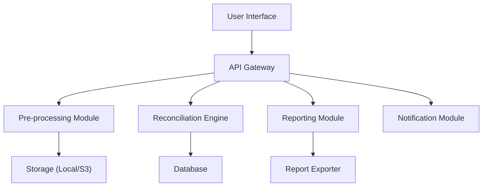

# Reconciler

The Reconciliation Platform is a comprehensive solution designed to facilitate and automate the reconciliation process. It is built with modularity in mind, ensuring each component can function independently while seamlessly integrating with others.

## Table of Contents

- [Modules](#modules)
  - [Pre-processing](#pre-processing)
  - [Reconciliation Engine](#reconciliation-engine)
  - [Reporting](#reporting)
  - [Notification](#notification)
- [Architecture Overview](#architecture-overview)
- [Getting Started](#getting-started)
- [Contributing](#contributing)
- [License](#license)

## Modules

### Pre-processing

Handles the initial stages of the reconciliation process:

- **File Upload**: Accepts and processes file uploads, ensuring they are in the correct format and free from common errors.
- **File Metadata Determination**: Extracts and determines metadata from uploaded files.
- **Unique File ID Generation**: Every file is assigned a unique ID based on its content to avoid duplication and ensure traceability.
- **File Storage**: Files are saved to a designated storage location, with future support for cloud storage solutions like Amazon S3.

### Reconciliation Engine

This is the core of the platform where the actual reconciliation takes place:

- **Data Comparison**: Compares data between primary and comparison files.
- **Rule Application**: Applies user-defined rules to handle discrepancies.
- **Result Generation**: Produces a detailed report of the reconciliation, highlighting matches, mismatches, and any issues encountered.

### Reporting

Generates detailed reports post-reconciliation:

- **Visual Reports**: Graphical representation of reconciliation results.
- **Detailed Logs**: In-depth logs detailing every step of the reconciliation process.
- **Export Options**: Allows users to export reports in various formats like PDF, CSV, etc.

### Notification

Keeps users informed:

- **Email Alerts**: Sends email notifications about the status of reconciliation tasks.
- **Dashboard Notifications**: Real-time notifications on the platform's dashboard.

## Architecture Overview

Below is a high-level architecture diagram of the reconciliation platform:

## Getting Started

1. **Prerequisites**: Ensure you have `Go` installed and set up on your machine.
2. **Clone the Repository**: `git clone https://github.com/nkasozi/reconciler-io.git`
3. **Navigate to Directory**: `cd econciler-io`
4. **Install Dependencies**: `go mod tidy`
5. **Run the Application**: `go run main.go`

## Contributing

We welcome contributions! Whether it's bug fixes, feature enhancements, or new modules, your input is valued. Please ensure to follow the coding standards and guidelines provided.

## License

This project is licensed under the MIT License. See the `LICENSE` file for details.

---

This README provides a comprehensive overview of the Reconciliation Platform. As the platform evolves, the README can be updated to reflect new features and changes.
